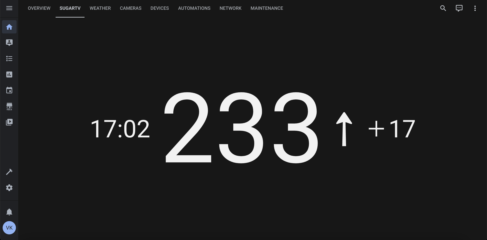

[](https://my.home-assistant.io/redirect/hacs_repository/?owner=wiltodelta&repository=homeassistant-sugartv-card&category=lovelace)

# SugarTV Card

A custom lovelace card for Home Assistant that provides a better way to display Dexcom data. This card aims to present the data in a visually appealing and easy-to-understand format, making it easier for users to monitor their glucose levels.



## Features

- Using default Dexcom integration for Home Assistant
- Displays current glucose value, trend and last updated time
- Supports View type "Panel (1 card)"

## Installation

### Prerequisites

- Home Assistant with HACS (Home Assistant Community Store) installed
- Dexcom integration set up in Home Assistant

### Installing via HACS

1. Go to the HACS section in your Home Assistant instance.
2. Click on the three dots in the top right corner and select "Custom repositories."
3. Add the URL to this repository and select the "Lovelace" category.
4. Click the "ADD" button.
5. Install the card from the HACS store.

## Example

```yaml
type: custom:sugartv-card
value_entity: sensor.dexcom_glucose_value
trend_entity: sensor.dexcom_glucose_trend
```

## License

This project is licensed under the MIT License. See the LICENSE file for details.
