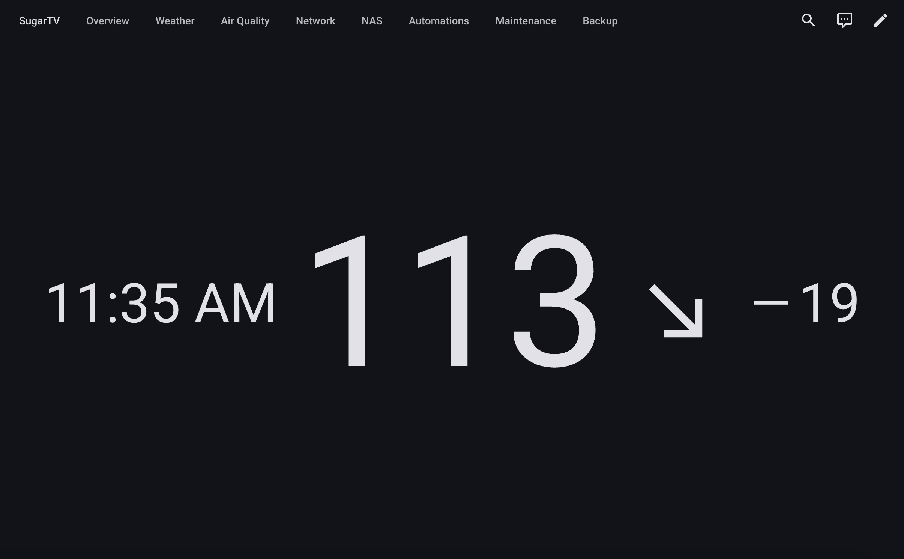

# 📺 SugarTV Card

[](https://github.com/hacs/integration)

A custom Lovelace card for Home Assistant that provides an enhanced way to display Dexcom data. This card presents glucose information in a visually appealing and easy-to-understand format, making glucose monitoring more convenient.




## Features

- 🔌 Uses default Dexcom integration for Home Assistant
- 📊 Displays:
  - Current glucose value
  - Difference from previous reading
  - Trend direction
  - Last update time
  - Glucose prediction for next 15 minutes
- 🌍 Automatic local time format support
- 📏 Automatic unit support (mmol/L and mg/dL)
- 📱 Responsive card sizing
- ⚙️ Visual configuration editor
- 🔮 Configurable prediction display

## Installation

### Prerequisites

1. Home Assistant with HACS (Home Assistant Community Store) installed
2. Dexcom integration set up in Home Assistant

### Installing via HACS

1. Open HACS in Home Assistant
2. Navigate to "Frontend" section
3. Click the "+" button
4. Search for "SugarTV Card"
5. Click "Install"
6. Restart Home Assistant


## Configuration

### Using the UI

1. Add a new card to your dashboard
2. Choose "Custom: SugarTV Card"
3. Use the visual editor to configure:
   - Select glucose value sensor
   - Select glucose trend sensor
   - Toggle prediction display

### Using YAML

```yaml
type: custom:sugartv-card
glucose_value: sensor.dexcom_glucose_value
glucose_trend: sensor.dexcom_glucose_trend
show_prediction: true
```

## Support

- 🐛 Found a bug? [Create an issue](https://github.com/wiltodelta/homeassistant-sugartv-card/issues)
- 💡 Have an idea? [Suggest an improvement](https://github.com/wiltodelta/homeassistant-sugartv-card/issues)
- ⭐ Like the project? Star it on GitHub!

## License

This project is licensed under the MIT License. See the [LICENSE](LICENSE) file for details.
