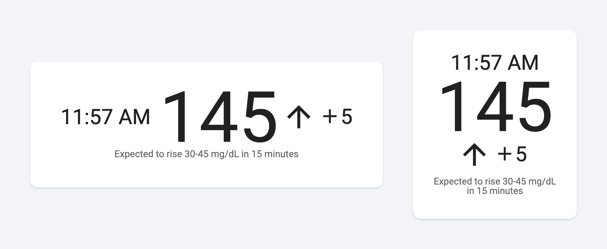
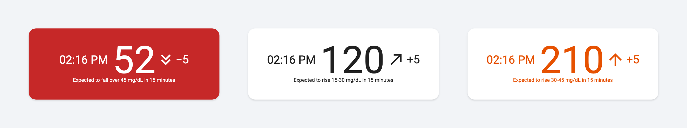

# SugarTV Card

[](https://github.com/hacs/integration)

A custom Lovelace card for Home Assistant that displays CGM (Continuous Glucose Monitor) data. Supports **Dexcom**, **Nightscout**, **LibreView**, **LibreLink**, and **Carelink (Medtronic)** with automatic trend detection.



One card and one config in two slots: it takes the shape it is given.

## Features

- **Multi-sensor support** — Dexcom, Nightscout, LibreView, LibreLink, Carelink (auto-detected)
- Displays: current glucose, delta from previous reading, trend direction, last update time, glucose prediction
- Color-coded glucose zones (AGP/TIR standard thresholds)
- Stale data indicator — the card fades once three polls have been missed,
  measured against the sensor's own update interval
- Tap to open HA more-info dialog with history graph
- Automatic local time format and unit support (mmol/L and mg/dL)
- Adapts to the space it is given: a wide slot lays the reading out in a row, a
  tall or square one stacks it into a column, and the type scales to fill either.
  No layout option and no font sizes to set.
- Visual configuration editor

## Supported integrations

| Integration              | Value Entity                       | Trend Detection                                 |
| ------------------------ | ---------------------------------- | ----------------------------------------------- |
| **Dexcom**               | `sensor.*_glucose_value`           | Auto-detected from `*_glucose_trend` entity     |
| **Nightscout**           | `sensor.blood_sugar`               | Auto-detected from `direction` attribute        |
| **LibreView** (PTST)     | `sensor.*_glucose_level`           | Auto-detected from `trend` attribute            |
| **LibreLink** (gillesvs) | `sensor.*_glucose_measurement`     | Auto-detected from sibling `*_trend` entity     |
| **Carelink** (Medtronic) | `sensor.*last_glucose_level_mg_dl` | Auto-detected from `*last_glucose_trend` entity |

Just select your glucose sensor — the card figures out the rest automatically.

## Installation

### Prerequisites

1. Home Assistant with HACS (Home Assistant Community Store) installed
2. One of the CGM integrations in the table above, already set up and reporting

### Installing via HACS

1. Open HACS in Home Assistant
2. Navigate to "Frontend" section
3. Click the "+" button
4. Search for "SugarTV Card"
5. Click "Install"
6. Restart Home Assistant

## Configuration

### Using the UI

1. Add a new card to your dashboard
2. Choose "Custom: SugarTV Card"
3. Use the visual editor to configure:
    - Select glucose value sensor
    - Toggle prediction display
    - Toggle color-coded glucose zones
    - Customize glucose thresholds

### Using YAML

```yaml
# Minimal — just one entity, trend auto-detected
type: custom:sugartv-card
glucose_value: sensor.jane_glucose_value
```

```yaml
# Full config with all options
type: custom:sugartv-card
glucose_value: sensor.jane_glucose_value
glucose_trend: sensor.jane_glucose_trend # optional override
timestamp_attribute: measurement_timestamp # optional override
show_prediction: true
color_thresholds: true
thresholds:
    urgent_low: 54 # mg/dL (or 3.0 mmol/L)
    low: 70 # mg/dL (or 3.9 mmol/L)
    high: 180 # mg/dL (or 10.0 mmol/L)
    urgent_high: 250 # mg/dL (or 13.9 mmol/L)
```

`sensor.jane_*` is a placeholder. Your entity ids depend on the integration, so
check Developer Tools, States and match the patterns in the table above. Dexcom,
for example, builds the id from your account username, so it is
`sensor.<username>_glucose_value`, with no `dexcom_` prefix.

### Options

| Option                | Type      | Default              | What it does                                                                      |
| --------------------- | --------- | -------------------- | --------------------------------------------------------------------------------- |
| `glucose_value`       | entity id | required             | The sensor holding the reading. Everything else is derived from it.               |
| `glucose_trend`       | entity id | auto-detected        | Point at the trend entity when the card cannot find it. YAML only.                |
| `timestamp_attribute` | string    | auto-detected        | Attribute holding the measurement time, for an integration not listed above.      |
| `show_prediction`     | boolean   | `true`               | The line of text under the reading.                                               |
| `relative_time`       | boolean   | `false`              | Show the reading's age ("14 min ago") in place of the clock.                      |
| `dim_fresh_time`      | boolean   | `false`              | Keep the time quiet while the reading is current, at full strength once it ages.  |
| `color_thresholds`    | boolean   | `true`               | Colour the reading by zone.                                                       |
| `thresholds`          | object    | AGP/TIR for the unit | `urgent_low`, `low`, `high`, `urgent_high`, in whatever unit your sensor reports. |
| `locale`              | string    | your HA language     | Formats the clock and the number, for example `en-GB` or `ru-RU`. YAML only.      |

`glucose_trend` and `locale` are the two you have to write by hand; the rest are
in the visual editor.

#### Where the clock format and the decimal separator come from

The card takes both from Home Assistant, in this order.

1. **Your Home Assistant profile**, if you have set Time format or Number format
   there. Those are explicit choices about clocks and digits, so they win. Both
   ship set to "auto-detect from language", in which case they defer.
2. **The card's `locale`**, if you set one.
3. **Your Home Assistant language**.

The order matters for one common case. Home Assistant's language list has `en`
and `en-GB`, and `en` on its own means American English to a browser, so a
24-hour country running Home Assistant in plain English gets an AM/PM clock
unless something says otherwise. Setting Time format to 24 hours in your profile
is that something; `locale: en-GB` on the card is another.

They are deliberately not separate card options. A card showing 15:12 beside 8.1
is half German and half English, so the clock, the decimal separator and the
digits are decided together or the card contradicts itself.

The card is translated into all 64 languages Home Assistant ships, and a test
fails when Home Assistant adds one the card has not caught up with. Only English
and Russian are maintainer-written; the rest are machine-assisted and have not
been checked by a native speaker, so corrections are genuinely welcome.
`src/localize.js` holds all of it, one block per language, and
`test/localize.test.js` will tell you if a key or a `{0}` slot goes missing.

That covers the card face, the editor's own labels, and the card's name in the
picker you add it from. The last two arrive without a Home Assistant object
attached, so they read the language off the frontend directly; up to v0.12.0
they were English whatever your language was.

### The forecast line

`show_prediction` puts a line like "Expected to rise 30-45 mg/dL in 15 minutes"
under the reading. It is worth knowing exactly what that is: a plain-language
restatement of the trend arrow your integration already sent, with the range
each arrow conventionally stands for. It is not a computed forecast, it does not
look at your history, and it cannot know about insulin or food. Treat it as the
arrow spelled out, and turn it off if you would rather it were not there.

### Layout

There is no layout option, on purpose. The card reads the shape of the slot it
is given and picks the arrangement that fills it, so it stays right when you
rearrange a dashboard instead of needing to be told again. The two arrangements
are the pair at the top of this page.

| Slot              | Layout                                     |
| ----------------- | ------------------------------------------ |
| Wider than 5:3    | Row: time, reading and trend on one line   |
| Narrower than 5:3 | Column: the reading stacked over its trend |

The type scales to fill either one, which is why there are no font sizes to
set. 5:3 is not a taste call: it is the point where the column starts giving a
larger reading than the row.

**To get the vertical layout**, give the card a slot taller than it is wide:

- **Sections view** is where this works, because it gives the card a definite
  size. The card starts at 6 columns by 1 row, which is wide and short; open its
  layout options and raise the rows or drop the columns until the slot is
  narrower than 5:3, and it turns vertical. It goes down to 3 columns.
- **Masonry view** never sets a card height, so the card keeps its own
  proportions there and always lays out as a row.
- **Panel and full-screen views** follow the same rule as any other slot: a tall
  narrow panel gets the column, a wide one gets the row.

### Reading time

The time on the card is when the reading was last confirmed, and it drives the
dimming of stale data.

The card resolves it in this order:

1. The attribute named by `timestamp_attribute`, if you set one.
2. A `measurement_timestamp` attribute (LibreView).
3. A `date` attribute, but only on a sensor that also carries Nightscout's
   `direction`/`delta` attributes, since `date` is a generic name.
4. A sibling entity holding the time: `*last_glucose_update` (Carelink) or
   `*_minutes_since_update` (LibreLink).
5. The entity's `last_updated`, then `last_changed`.

Both ISO date strings and epoch values (seconds or milliseconds) are accepted;
anything unparseable falls back to the next step.

**Accuracy depends on your integration**, because Home Assistant only advances
`last_updated` when the state or one of its attributes actually changes. A poll
that re-reports an identical value with identical attributes leaves both
`last_updated` and `last_changed` frozen. Home Assistant records that poll in
`last_reported`, which it does not send to the frontend, so a card cannot see
it. That is why the card prefers a time the integration itself reports.

| Integration      | Reading time                                                                   |
| ---------------- | ------------------------------------------------------------------------------ |
| LibreView (PTST) | Exact, from `measurement_timestamp`                                            |
| Nightscout       | Exact, from `date`                                                             |
| Carelink         | Exact, from the `*last_glucose_update` entity                                  |
| LibreLink        | To the minute while the reading is recent, from `*_minutes_since_update`       |
| Dexcom           | Approximate: it publishes no time at all, so a flat value can still look stale |

LibreLink is the weak one. It reports an age rather than a time, and computes it
by subtracting a device-local reading time from the Home Assistant server's
clock, so the number is wrong by the offset between the two timezones
([gillesvs/librelink#27](https://github.com/gillesvs/librelink/issues/27)
reports -118 minutes). A wrong age cannot be told apart from an old reading, so
the card only trusts an age below the staleness threshold. Past it, the age and
`last_updated` both say "stale" anyway.

If your integration reports the measurement time under some other attribute of
the glucose sensor, point the card at it with `timestamp_attribute`.

#### Showing the age instead of the clock

On a wall display a clock reading is one subtraction away from the thing you
actually want to know, and next to a real clock it reads as a second clock. Set
`relative_time: true` and the card shows how old the reading is in that spot
instead: "14 min ago", "14 мин назад", "vor 14 Min". Under a minute it reads
"now", past an hour it counts in hours.

It is one or the other, not both. Every word comes from the browser's own locale
data rather than from anything the card ships, so it is right in every language
Home Assistant runs in, and it is the same phrasing Home Assistant uses
elsewhere in its interface. The stop CLDR puts after an abbreviated unit is
dropped in every language, so the card reads "14 min ago" and "vor 14 Min"
rather than carrying a full stop in some languages and not others. Hebrew is
spelled out instead, since the mark it abbreviates with is what makes the word
an abbreviation at all.

Languages differ a lot in how long this runs: "14 min ago" fits anywhere, "14
perccel ezelőtt" is nearly three times the width of the clock it replaces. Since
the line cannot wrap, the card measures the phrase and scales it down when it
would not fit beside the reading. The time gives way rather than the number,
which is the one thing the card exists to show.

Some browsers are built with a trimmed locale data set and have no wording for
every language. Rather than dropping to English in the middle of an otherwise
translated card, the card keeps showing the clock for those. If you turn this on
and still see a clock, that is why.

#### Letting the time fade into the background

The time is only worth reading when it has something to say. Set
`dim_fresh_time: true` and it sits at low contrast while the reading is current,
then comes up to full strength once a poll has been missed, before the card
dims as a whole. Glance at it and you can tell without reading it that there is
nothing to read.

The three tiers come off the same measured cadence as staleness, so they mean
the same thing on any sensor: quiet for one interval, loud for the next two,
the whole card dimmed after that. It works with either time display, and it
does not colour anything. Orange already means "out of range" here, so an aging
time on a high reading would paint two different meanings the same colour.

#### When the card calls a reading stale

The card dims once three polls have gone missing. Three of what depends on your
sensor, so the card measures rather than assumes: it reads the gaps between your
own readings in the recorder history and takes the smallest one as the update
interval. A one minute CGM therefore dims after three minutes, a five minute one
after fifteen.

There is no setting for this, and the interval is not asked for. The card
already reads history to compute the delta, so the answer is in data it holds.

Two deliberate limits. It takes the smallest gap rather than an average, because
Home Assistant writes no history entry when a reading repeats, and averaging
would stretch the window on exactly the flat stretches where a stuck sensor most
needs catching. And a measured interval can only shorten the window, never
extend it past fifteen minutes: a live sensor that looks stale is a harmless
failure, a dead one that looks live is not. With the recorder disabled, fifteen
minutes is what you get.

### Glucose zone thresholds

Color-coded zones are enabled by default using the [AGP/TIR international standard](https://diabetesjournals.org/care/article/42/8/1593/36034) thresholds.



| Zone        | mg/dL     | mmol/L      | Style                      |
| ----------- | --------- | ----------- | -------------------------- |
| Urgent Low  | < 54      | < 3.0       | Red background, white text |
| Low         | 54 – 70   | 3.0 – 3.9   | Orange text                |
| In Range    | 70 – 180  | 3.9 – 10.0  | Normal                     |
| High        | 180 – 250 | 10.0 – 13.9 | Orange text                |
| Urgent High | > 250     | > 13.9      | Red background, white text |

To disable color coding, set `color_thresholds: false` or use the toggle in the visual editor.

### Theme integration

Colors can be customized via CSS custom properties in your HA theme:

```yaml
# In your HA theme
sugartv-urgent-bg: '#c62828'
sugartv-urgent-text: '#ffffff'
sugartv-warning-text: '#e65100'
```

## Troubleshooting

**The reading shows N/A.** The card is pointed at an entity Home Assistant has
no value for. Open Developer Tools, States and check the entity id exists and
holds a number; ids differ between installs even for the same integration, which
is why the table above matches the tail of an id rather than the whole thing.

**The trend is a question mark.** The card could not find a trend to go with the
reading. It looks for a sibling entity next to your glucose sensor, so a renamed
entity breaks the link. Set `glucose_trend` explicitly.

**The colours look wrong for my unit.** Thresholds are stored as plain numbers,
so a set written for mg/dL means something very different against a mmol
reading. The card drops thresholds that exactly match the other unit's defaults,
but it cannot second-guess numbers you chose yourself. Clear `thresholds` to
fall back to the standard ones for your unit.

**The clock is behind, or the card greys out while the sensor is fine.** The
card can only show a time its integration reports. Dexcom publishes none, so the
card falls back to when Home Assistant last saw the value change, and a reading
that repeats leaves that frozen. The table under Reading time above says what
each integration offers.

**I wanted the vertical layout.** It follows the shape of the slot, not a
setting. See Layout above.

## Support

- Found a bug? [Create an issue](https://github.com/wiltodelta/homeassistant-sugartv-card/issues)
- Have an idea? [Suggest an improvement](https://github.com/wiltodelta/homeassistant-sugartv-card/issues)
- Like the project? Star it on GitHub!

If this card is useful to you, please consider supporting its development:

[](https://github.com/sponsors/wiltodelta)

## License

This project is licensed under the MIT License. See the [LICENSE](LICENSE) file for details.
