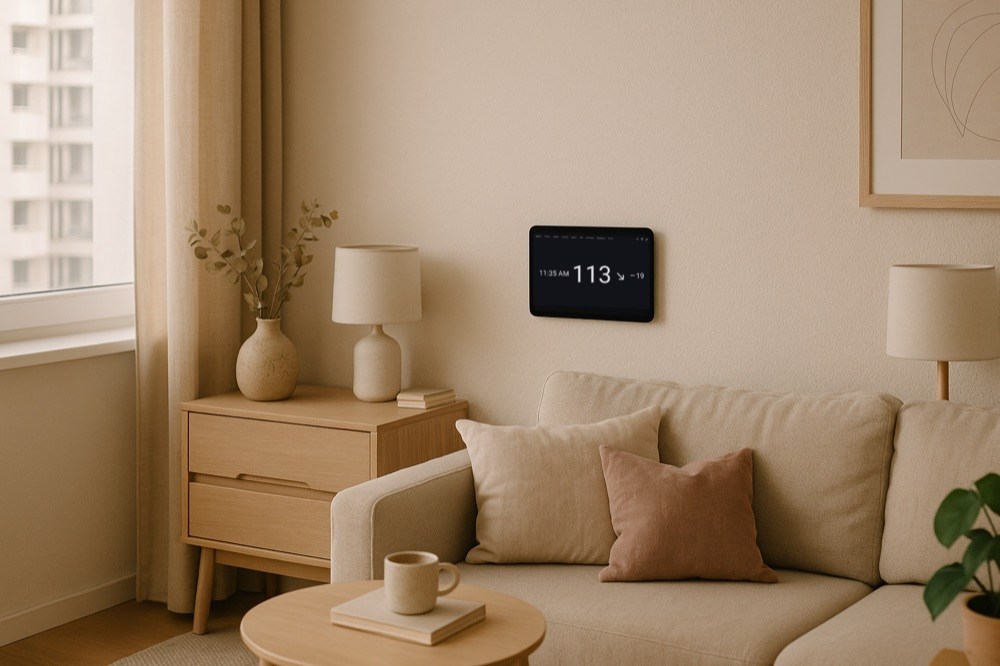
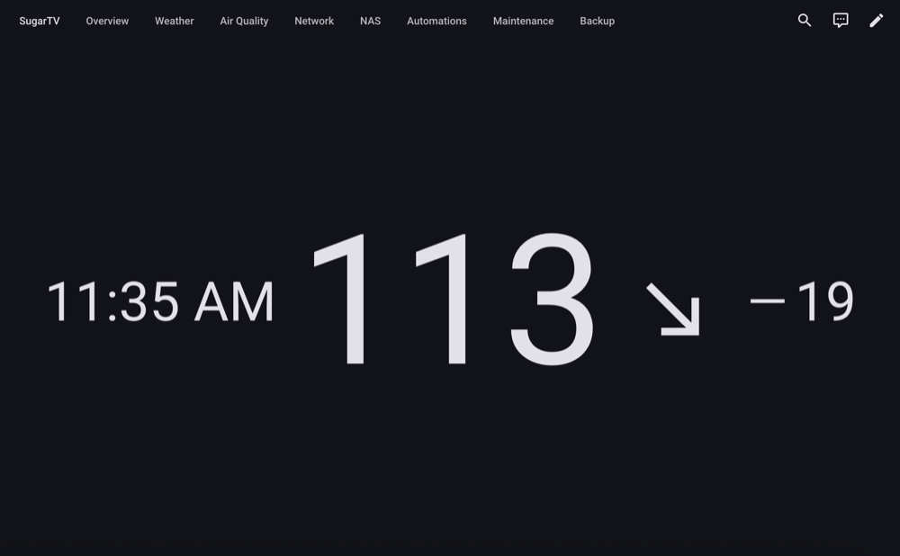
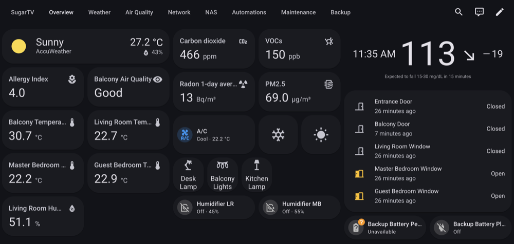

# 📺 SugarTV Card

[](https://github.com/hacs/integration)

A custom Lovelace card for Home Assistant that provides an enhanced way to display Dexcom data. This card presents glucose information in a visually appealing and easy-to-understand format, making glucose monitoring more convenient.





## Features

- 🔌 Uses default Dexcom integration for Home Assistant
- 📊 Displays:
    - Current glucose value
    - Difference from previous reading
    - Trend direction
    - Last update time
    - Glucose prediction for next 15 minutes
- 🎨 Color-coded glucose zones (AGP/TIR standard thresholds)
- ⏰ Stale data indicator — time turns red when data is older than 15 minutes
- 🌍 Automatic local time format support
- 📏 Automatic unit support (mmol/L and mg/dL)
- 📱 Responsive card sizing
- ⚙️ Visual configuration editor
- 🔮 Configurable prediction display

## Installation

### Prerequisites

1. Home Assistant with HACS (Home Assistant Community Store) installed
2. Dexcom integration set up in Home Assistant

### Installing via HACS

1. Open HACS in Home Assistant
2. Navigate to "Frontend" section
3. Click the "+" button
4. Search for "SugarTV Card"
5. Click "Install"
6. Restart Home Assistant

## Configuration

### Using the UI

1. Add a new card to your dashboard
2. Choose "Custom: SugarTV Card"
3. Use the visual editor to configure:
    - Select glucose value sensor
    - Select glucose trend sensor
    - Toggle prediction display
    - Toggle color-coded glucose zones
    - Customize glucose thresholds

### Using YAML

```yaml
type: custom:sugartv-card
glucose_value: sensor.dexcom_glucose_value
glucose_trend: sensor.dexcom_glucose_trend
show_prediction: true
color_thresholds: true
```

### Glucose Zone Thresholds

Color-coded zones are enabled by default using the [AGP/TIR international standard](https://diabetesjournals.org/care/article/42/8/1593/36034) thresholds. You can customize them:

```yaml
type: custom:sugartv-card
glucose_value: sensor.dexcom_glucose_value
glucose_trend: sensor.dexcom_glucose_trend
thresholds:
    urgent_low: 54 # mg/dL (or 3.0 mmol/L)
    low: 70 # mg/dL (or 3.9 mmol/L)
    high: 180 # mg/dL (or 10.0 mmol/L)
    urgent_high: 250 # mg/dL (or 13.9 mmol/L)
```

| Zone        | mg/dL     | mmol/L      | Style                      |
| ----------- | --------- | ----------- | -------------------------- |
| Urgent Low  | < 54      | < 3.0       | Red background, white text |
| Low         | 54 – 70   | 3.0 – 3.9   | Orange text                |
| In Range    | 70 – 180  | 3.9 – 10.0  | Normal                     |
| High        | 180 – 250 | 10.0 – 13.9 | Orange text                |
| Urgent High | > 250     | > 13.9      | Red background, white text |

To disable color coding, set `color_thresholds: false` or use the toggle in the visual editor.

### Theme Integration

Colors can be customized via CSS custom properties in your HA theme:

```yaml
# In your HA theme
sugartv-urgent-bg: '#c62828'
sugartv-urgent-text: '#ffffff'
sugartv-warning-text: '#e65100'
```

## Support

- 🐛 Found a bug? [Create an issue](https://github.com/wiltodelta/homeassistant-sugartv-card/issues)
- 💡 Have an idea? [Suggest an improvement](https://github.com/wiltodelta/homeassistant-sugartv-card/issues)
- ⭐ Like the project? Star it on GitHub!

## License

This project is licensed under the MIT License. See the [LICENSE](LICENSE) file for details.
